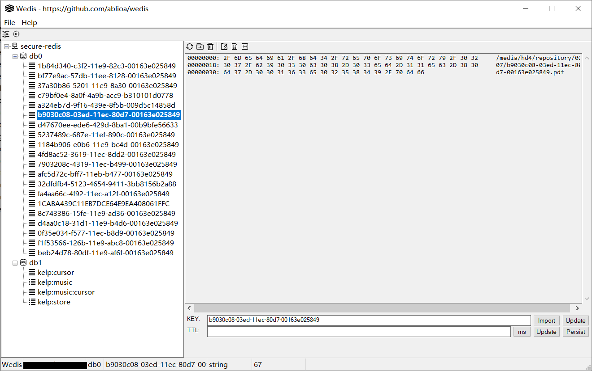

# About Wedis
---
The wedis project is aim to build a light weight redis client.

# Build Wedis
---
Wedis can be compiled and used on windows.

wedis is written in C and compiled with MinGW,it depends on nothing but windows system libirary.

1. make sure that gcc compiler in MinGW is set in evironment variables.

2. enter directory **src**

3. %make

4. wedis.exe file can be found in **output** directory.

# Screen Shot
---

